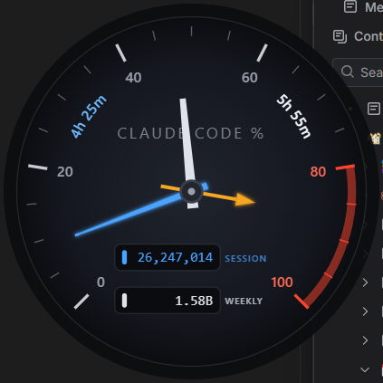

# Claude Usage Widget

A floating, always-on-top Windows desktop widget that shows your Claude account
usage as a circular fuel gauge, with a rev-counter needle showing live token
throughput.



## Download (no code required)

Grab **Claude Usage Widget Setup x.x.x.exe** from the
[latest release](https://github.com/matthelam/claude-windows-widget/releases/latest)
and run it. The widget installs per-user (no admin needed), adds itself to
Windows startup, and appears in Settings > Apps with a normal uninstaller.
Requires [Claude Code](https://claude.com/claude-code) to be logged in on the
same machine — the widget reads its local session.

## What it shows

A single 0–100% dial with up to three watch-style pins — no labels needed,
each pin has its own length, weight, shape, and color:

- **Session** (5-hour limit): long, thin, bright-blue needle with a glow —
  the fast mover.
- **Weekly** (all models): shorter, broader, silver blade.
- **Model-scoped weekly** (e.g. Fable): short amber pin with an arrow tip.
  It only appears while the API reports that limit; no scoped limit, no pin.

These match the meters on Claude's *Settings > Usage* screen. The last 20% of
the dial is redlined.

**Odometers** on the gauge face show total tokens processed (including cache
reads) in the current 5-hour session window and the rolling 7-day window,
computed from Claude Code's local transcripts. Digit colors match the pins:
blue = session, silver = weekly.

**Reset countdowns** curve along the dial ring like bezel text — the blue
session timer in the 20-40 gap, the silver weekly timer in the 60-80 gap.
They tick locally off the system clock (no polling); when one hits zero the
widget fetches fresh reset times and the just-reset pin snaps back with it.

## Data sources (all local / your own account)

> **No separate billing.** The usage endpoint below is an account-metadata call
> made with your existing subscription login — the same call the Claude app
> uses for its Settings > Usage screen. It runs no model, consumes no tokens,
> and is not the pay-per-token Anthropic API. This widget cannot incur charges.

- Plan limit percentages (the pins): `https://api.anthropic.com/api/oauth/usage`,
  authenticated with the Claude Code OAuth token already stored in
  `%USERPROFILE%\.claude\.credentials.json`. Polled every 60 seconds (15s retry
  after an error). The token never goes anywhere except Anthropic's API. The
  reset timestamps from this endpoint also define the odometer windows.
- Token totals (the odometers): `%USERPROFILE%\.claude\projects\**\*.jsonl`
  (Claude Code transcripts). The last 7 days are scanned once at startup, then
  new lines are tailed every 2 seconds. Note this measures **Claude Code
  activity on this machine** — usage from the claude.ai website or other
  devices moves the pins, but not the odometers.

## Running

```
npm install
npm start
```

Or double-click **`Claude Widget.vbs`** to launch it silently (no console window).

### Start automatically at login

Press `Win+R`, type `shell:startup`, press Enter, and drop a shortcut to
`Claude Widget.vbs` into that folder.

## Controls

- **Drag** anywhere on the gauge to move it (position is remembered).
- **Resize** by dragging any edge or corner of the widget — the gauge keeps its
  aspect ratio and scales between 200px and 800px wide (size is remembered).
- **Hover** anywhere over the widget and a close ✕ fades in at the top-right.
- **Right-click** for a menu: toggle always-on-top, refresh now, quit.

## Troubleshooting

- **"auth expired"** at the bottom of the dial: open Claude Code and run any
  prompt — it refreshes the OAuth token in `.credentials.json`, and the widget
  picks it up on its next poll.
- **"rate limited — retrying shortly"**: transient 429 from the usage endpoint;
  the widget keeps showing the last good data and retries in 15 seconds.
- Odometers show **—**: they need one successful usage fetch (for the window
  reset times) plus the startup history scan; give it a few seconds.
