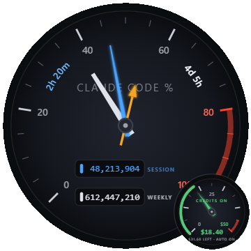
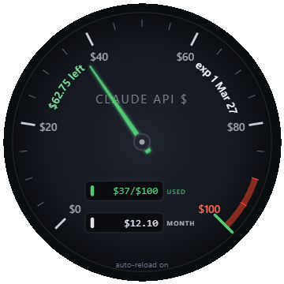

# Claude Usage Widget

A floating, always-on-top Windows desktop gauge for your Claude usage. It has
two modes:

- **Subscription**: your Pro/Max plan limits as watch-style pins, with reset
  countdowns, token odometers and a usage-credits subdial.
- **API credits**: your Claude Console prepaid credit, in dollars.

| Subscription mode | API credits mode |
| --- | --- |
|  |  |

## Download (no code required)

Grab **Claude Usage Widget Setup x.x.x.exe** from the
[latest release](https://github.com/matthelam/claude-windows-widget/releases/latest)
and run it. It installs per user (no admin needed), adds itself to Windows
startup, and appears in Settings > Apps with a normal uninstaller.

Subscription mode needs [Claude Code](https://claude.com/claude-code) signed in
on the same machine, because the widget reads its local session. API credits
mode needs a one-off sign-in to the Claude Console from the widget.

## Subscription mode

A 0–100% dial with up to three pins. Each has its own length, weight, shape
and colour, so no labels are needed:

- **Session** (5-hour limit): long, thin, bright-blue needle.
- **Weekly** (all models): shorter, broader, silver blade.
- **Model-scoped weekly** (for example Fable): short amber arrow. It appears
  only while your account reports that limit.

These are the same meters as Claude's *Settings > Usage* screen. The last 20%
of the dial is redlined.

**Reset countdowns** curve along the bezel: blue for the session in the 20–40
gap, silver for the week in the 60–80 gap. They tick off your PC clock, so
they cost no network calls; when one reaches zero the widget fetches fresh
figures and the reset pin drops back.

**Odometers** show total tokens processed (cache reads included) in the
current session window and the rolling 7-day window, counted from Claude
Code's transcripts on this PC. Blue digits are the session, silver the week.

**Usage credits subdial**: if usage credits are set up on your subscription, a
small green gauge sits at the lower right. Everything in it comes from the
usage data automatically:

- your spend this month against the monthly cap you set (for example A$100);
- the state: `CREDITS ON`, `NO CREDITS` (out of credits), `CREDITS OFF` or
  `LIMIT HIT`, with the needle and arc turning amber or red to match;
- remaining balance and auto-reload, shown underneath whenever Anthropic
  includes them (they are not reported for every account).

## API credits mode

Right-click › **Mode › API credits** switches to the prepaid credit in your
Claude Console (the developer API, billed separately from your subscription).
Sign in once with right-click › **Sign in to Console…**; the window closes by
itself when the sign-in succeeds.

- **Dial**: dollars used. The scale rounds up to tidy steps ($0–50 by $10,
  $0–1.5k by $300 and so on), a **green notch** marks where your loaded credit
  ends, and the **redline** covers the last 10% before it.
- **Bezel**: remaining balance on the left, earliest credit expiry on the right.
- **USED box**: credit used against credit loaded, for example `$2.24/$50`.
- **MONTH box**: this month's spend, and your spend limit if you set one.
- **Status line**: whether auto-reload is on.

New top-ups appear by themselves on the next refresh (every 5 minutes, or
right-click › Refresh now), and the scale adjusts to the new total.

> **Unofficial data source.** Anthropic offers no public endpoint for prepaid
> balance, and its Admin API is not available to individual accounts, so this
> mode reads the internal endpoints the Console billing page uses. They may
> change without notice. When they stop answering, the widget blanks its
> readings rather than show stale numbers.

## Controls

- **Drag** anywhere on the gauge to move it.
- **Resize** by dragging an edge or corner (200–800 px, aspect ratio kept).
- **Hover** to reveal the close ✕ at the top right.
- **Right-click** for the menu:
  - Refresh now
  - Mode › Subscription / API credits
  - Sign in to Console… / Sign out of Console (API mode)
  - Always on top
  - Start at login (installed version)
  - Quit

Position, size and mode are remembered. If a monitor is unplugged or
rearranged, the widget moves itself back onto a visible screen. Launching it
twice just brings the running copy forward.

## Data sources and privacy

> **No charges.** Reading usage and billing figures costs nothing. The one
> exception is the automatic login refresh below, which sends a one-word prompt
> through Claude Code and counts against your plan like any other prompt.

- **Plan limits and usage credits** (subscription mode):
  `https://api.anthropic.com/api/oauth/usage`, the same account call the Claude
  app uses for its usage screen, authenticated with the Claude Code login in
  `%USERPROFILE%\.claude\.credentials.json`. Polled every 3 minutes, with
  back-off after errors and respect for the server's retry-after.
- **Automatic login refresh**: when that login has expired, the widget makes no
  call with it. Instead it quietly runs `claude -p` once so Claude Code renews
  the login, at most once every 10 minutes.
- **Token odometers**: Claude Code transcripts in
  `%USERPROFILE%\.claude\projects`, read locally. They count Claude Code use
  on this PC only; claude.ai use in the browser moves the pins but not the
  odometers.
- **API credits**: the Claude Console billing endpoints, called with a sign-in
  held in the widget's own private session. The widget never sees or stores
  your password.
- **Diagnostics**: failed Console calls are logged to
  `%APPDATA%\claude-usage-widget\widget.log` (status codes and error text only).

## Building from source

```
npm install
npm start          # run in development
npm run dist       # build the Windows installer into dist/
```

`Claude Widget.vbs` starts the development copy without a console window.

Releases are automatic: push a tag such as `v1.2.0` and GitHub Actions builds
the installer and publishes a release. Tags with a hyphen (`v1.2.0-rc1`) are
published as pre-releases.

## Troubleshooting

- **"login expired — run Claude Code to refresh"**: the automatic refresh could
  not renew it. Run any Claude Code prompt and the widget picks up the new
  login within a minute.
- **"refreshing login…"**: the automatic refresh is running; wait a moment.
- **"rate limited — waiting to retry"**: the usage endpoint asked the widget to
  slow down. It keeps the last good figures and retries on its own.
- **Odometers show —**: they need one successful usage fetch plus the startup
  scan of recent transcripts; give it a few seconds.
- **"right-click › Sign in to Console"** (API mode): the Console sign-in has
  expired or was never completed. Sign in again from the menu.
- **"API data unavailable"** (API mode): the Console endpoints stopped
  answering. Check `widget.log` for the reason.
